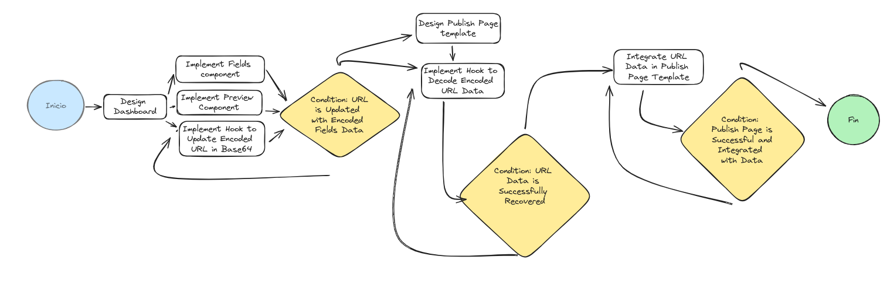

# Page Link

Ir a: [Page Link](https://page-link-ds.vercel.app/)

## Description

Page Link es una aplicación web que permite crear páginas de blocks de forma rápida y sencilla. Con un enfoque fácil, toda la información de la página se almacena eficientemente en la URL.

## Desarrollo

## Funcionalidades Destacadas

**Creación de Páginas en el Dashboard:**

- Diseña tu propia página de manera intuitiva utilizando el dashboard.
- Agrega contenido, imágenes y urls para hacer tu página única.

**Datos Codificados en la URL:**

- Después de completar tu página, los datos se codifican en una cadena base64.
- La URL generada se convierte en un contenedor portátil que lleva consigo toda la información de tu página.

**Publicación con un Solo Clic:**

Haz clic en "Hacer Pública" cuando estés listo para compartir tu creación.
La URL única resultante lleva a los usuarios a tu página, recuperando y renderizando los datos de manera instantánea.

## Cómo Utilizar

Ingresa al dashboard: https://page-link-ds.vercel.app/

Completa tu página con el contenido que desees.
Haz clic en "Hacer Pública" para generar la URL única.
Comparte la URL y permite que otros accedan a tu página personalizada.

## Ejemplo de Uso

https://page-link-ds.vercel.app/eyJuYW1lIjoiSmVzdXMgQ2VyZGFuIERpYXoiLCJkZXNjcmlwdGlvbiI6IkRlc2Fycm9sbGFkb3IgRnJvbnQtZW5kIGRpbsOhbWljbyBjb24gbcOhcyBkZSAxIGHDsW8gZGUgZXhwZXJpZW5jaWEuIEVzcGVjaWFsaXphZG8gZW4gZWwgZGlzZcOxbyB5IG1hcXVldGFkbyB3ZWIsIGRlc3RhY8OzICBwb3IgYXNlZ3VyYXIgbGEgYWRhcHRhYmlsaWRhZCBlZmljaWVudGUgZGUgbGFzIHDDoWdpbmFzIHNlZ8O6biBlbCBkaXNwb3NpdGl2by4gRXhwZXJpZW5jaWEgc8OzbGlkYSBlbiBKYXZhU2NyaXB0LCBDU1MsIEhUTUwgeSBSZWFjdC4iLCJhdmF0YXIiOiJodHRwczovL3VuYXZhdGFyLmlvL2dpdGh1Yi9pbWplc3VzYyIsImZhY2Vib29rIjoiIiwidHdpdHRlciI6IiIsImluc3RhZ3JhbSI6IiIsImdpdGh1YiI6Imh0dHBzOi8vZ2l0aHViLmNvbS9pbWplc3VzYyIsImxpbmtlZGluIjoiaHR0cHM6Ly93d3cubGlua2VkaW4uY29tL2luL2ltamVzdXMvIiwiZW1haWwiOiJpYW1qZXN1cy5kc0BnbWFpbC5jb20ifQ==postsW3siaW1nUG9zdCI6Imh0dHBzOi8vcmF3LmdpdGh1YnVzZXJjb250ZW50LmNvbS9pbWplc3VzYy9wYWdlLWxpbmsvbWFpbi9wdWJsaWMvcGFnZS1saW5rLnBuZyIsInBvc3QiOiJDb25zdHJ1eWVuZG8gbWkgcG9zdCB3ZWJzaXRlIGNvbiBQYWdlIExpbmsuIiwibGluayI6Imh0dHBzOi8vcGFnZS1saW5rLWRzLnZlcmNlbC5hcHAvZXlKdVlXMWxJam9pU21WemRYTWdRMlZ5WkdGdUlFUnBZWG9pTENKa1pYTmpjbWx3ZEdsdmJpSTZJa1JsYzJGeWNtOXNiR0ZrYjNJZ1JuSnZiblF0Wlc1a0lHUnBic09oYldsamJ5QmpiMjRnYmNPaGN5QmtaU0F4SUdIRHNXOGdaR1VnWlhod1pYSnBaVzVqYVdFdUlFVnpjR1ZqYVdGc2FYcGhaRzhnWlc0Z1pXd2daR2x6WmNPeGJ5QjVJRzFoY1hWbGRHRmtieUIzWldJc0lHUmxjM1JoWThPeklDQndiM0lnWVhObFozVnlZWElnYkdFZ1lXUmhjSFJoWW1sc2FXUmhaQ0JsWm1samFXVnVkR1VnWkdVZ2JHRnpJSEREb1dkcGJtRnpJSE5sWjhPNmJpQmxiQ0JrYVhOd2IzTnBkR2wyYnk0Z1JYaHdaWEpwWlc1amFXRWdjOE96Ykdsa1lTQmxiaUJLWVhaaFUyTnlhWEIwTENCRFUxTXNJRWhVVFV3Z2VTQlNaV0ZqZEM0aUxDSmhkbUYwWVhJaU9pSm9kSFJ3Y3pvdkwzVnVZWFpoZEdGeUxtbHZMMmRwZEdoMVlpOXBiV3BsYzNWell5SXNJbVpoWTJWaWIyOXJJam9pSWl3aWRIZHBkSFJsY2lJNklpSXNJbWx1YzNSaFozSmhiU0k2SWlJc0ltZHBkR2gxWWlJNkltaDBkSEJ6T2k4dloybDBhSFZpTG1OdmJTOXBiV3BsYzNWell5SXNJbXhwYm10bFpHbHVJam9pYUhSMGNITTZMeTkzZDNjdWJHbHVhMlZrYVc0dVkyOXRMMmx1TDJsdGFtVnpkWE12SWl3aVpXMWhhV3dpT2lKcFlXMXFaWE4xY3k1a2MwQm5iV0ZwYkM1amIyMGlmUT09cG9zdHNXM3NpYVcxblVHOXpkQ0k2SW1oMGRIQnpPaTh2Y21GM0xtZHBkR2gxWW5WelpYSmpiMjUwWlc1MExtTnZiUzlwYldwbGMzVnpZeTl3WVdkbExXeHBibXN2YldGcGJpOXdkV0pzYVdNdmNHRm5aUzFzYVc1ckxuQnVaeUlzSW5CdmMzUWlPaUpEYjI1emRISjFlV1Z1Wkc4Z2JXa2djRzl6ZENCM1pXSnphWFJsSUdOdmJpQlFZV2RsSUV4cGJtc3VJbjFkIn0seyJpbWdQb3N0IjoiaHR0cHM6Ly9yYXcuZ2l0aHVidXNlcmNvbnRlbnQuY29tL2ltamVzdXNjL2Vjb21tZXJjZS1zYW5pdHktc3RyaXBlL21haW4vcHVibGljL3ByZXZpZXctMi5wbmciLCJwb3N0IjoiUHJveWVjdG8gZWNvbW1lcnNlIGNvbiBTYW5pdHkgeSBTdHJpcGUgdGVybWluYWRvLiIsImxpbmsiOiJodHRwczovL3Nhbml0eS1zdHJpcGUtZWNvbW1lcnNlLnZlcmNlbC5hcHAvIn0seyJpbWdQb3N0IjoiaHR0cHM6Ly9yYXcuZ2l0aHVidXNlcmNvbnRlbnQuY29tL2ltamVzdXNjL3BhZ2UtbGluay9tYWluL3B1YmxpYy9taWR1LWNzcy5wbmciLCJsaW5rIjoiaHR0cHM6Ly95b3V0dS5iZS82Nmt5M0RvcGNxMCIsInBvc3QiOiJDb25vY2llbmRvIG51ZXZhcyBub3ZlZGFkZXMgZGUgY3NzIGNvbiBNaWR1ZGV2LiJ9LHsibGluayI6Imh0dHBzOi8vaW1qZXN1c2MudmVyY2VsLmFwcCIsImltZ1Bvc3QiOiJodHRwczovL3Jhdy5naXRodWJ1c2VyY29udGVudC5jb20vaW1qZXN1c2MvcGFnZS1saW5rL21haW4vcHVibGljL3BvcnRmb2xpby5wbmciLCJwb3N0IjoiRGVzYXJyb2xsYW5kbyBtaSBwb3J0Zm9saW8uIn1d

> [!TIP]  
> Debido al tamaño de la url puedes usar un acortador de links como https://acortar.link/.  
> Ejemplo con link acortado: https://acortar.link/v42418
